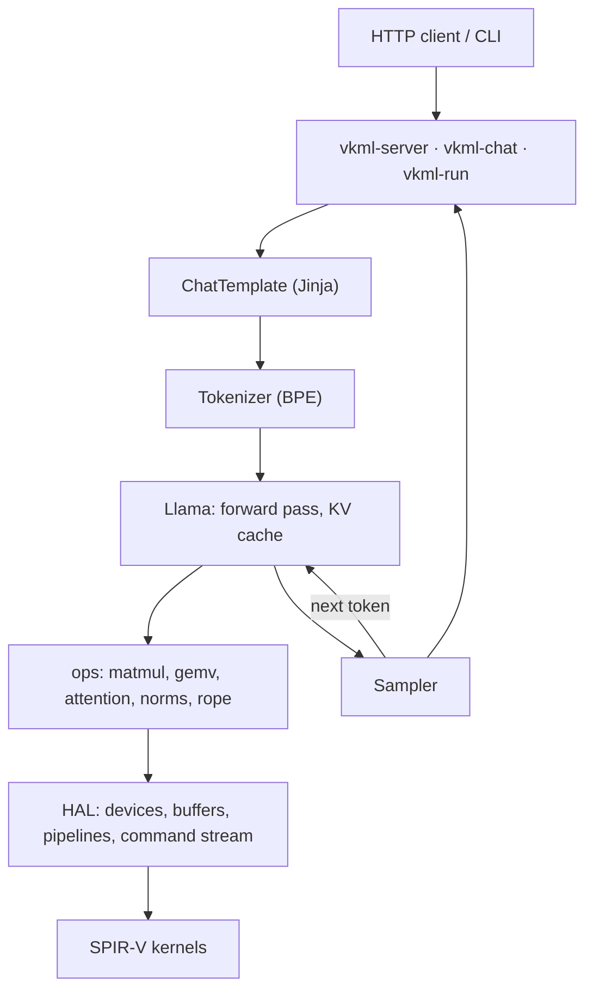

# vkml

**A from-scratch LLM inference engine on Vulkan compute.**

[](https://github.com/danielkwan-dev/vkml-framework/actions/workflows/ci.yml)
[](LICENSE)


vkml runs Hugging Face and GGUF language models on any GPU with a Vulkan 1.2
driver, from any vendor, with no CUDA, PyTorch or ggml. Everything from the
GPU kernels to the tokenizers, the Jinja chat templates and an
OpenAI-compatible server is written in C++20 and checked against Hugging Face
`transformers`. It is developed on an Intel laptop GPU and tested in CI on
Mesa's software Vulkan (lavapipe).


## Highlights

- **Matches `transformers`**: logits within ~1e-6 in f32, greedy generations
  token-identical, perplexity to 4 decimals, tokenizers and chat templates
  identical. lm-evaluation-harness gives the same ARC-Easy score through
  vkml as through its `transformers` backend.
- **10 model architectures**, from Hugging Face checkpoints (bf16/f16) or GGUF
  files (Q8_0, Q4_0 and K-quants), up to Mistral 7B on a laptop GPU.
- **Fast on modest hardware**: decoding reaches ~50 GB/s, the memory
  bandwidth limit of an Intel Iris Xe. int8 dot-product kernels took TinyLlama
  from 28 to 49 tokens/s.
- **OpenAI-compatible server**: chat and completions, streaming, tool calls
  (Qwen, Llama and Mistral formats), logprobs, reasoning content.
- **Engineered for trust**: 220 tests under the Vulkan validation layers,
  CI on a software GPU, double-precision references, fuzzed GGUF parsing.

## Quickstart

Build (Linux; see [docs/usage.md](docs/usage.md) for Windows):

```sh
bash tools/install-deps-ubuntu.sh   # compiler, CMake, Ninja, glslc, Vulkan loader
cmake --preset release && cmake --build --preset release
```

Chat with a Hugging Face checkpoint or a GGUF file:

```sh
vkml-chat --model models/SmolLM2-360M-Instruct
vkml-chat --model models/Llama-3.2-1B-Instruct-Q4_K_M.gguf
```

Serve it to any OpenAI client:

```sh
vkml-server --model models/qwen2.5-0.5b-instruct-q4_k_m.gguf --port 8080
```

```python
from openai import OpenAI
client = OpenAI(base_url="http://127.0.0.1:8080/v1", api_key="none")
for chunk in client.chat.completions.create(
        model="qwen", messages=[{"role": "user", "content": "Hi!"}], stream=True):
    print(chunk.choices[0].delta.content or "", end="")
```

Or use it as a library (`vkml::vkml` in CMake; full example in
[examples/quickstart.cpp](examples/quickstart.cpp)):

```cpp
#include <vkml/vkml.hpp>

vkml::Context context;  // picks the fastest GPU
auto a = vkml::Tensor::from_data<float>(context, std::vector<float>{1, 2, 3, 4}, {2, 2});
vkml::Tensor c = vkml::softmax(vkml::matmul(a, a));  // recorded for the GPU
std::vector<float> values = c.to_vector<float>();    // waits and reads back

vkml::Llama model = vkml::Llama::load(context, "models/SmolLM2-360M-Instruct", 1024);
vkml::Tokenizer tokenizer{"models/SmolLM2-360M-Instruct/tokenizer.json"};
vkml::Tensor logits = model.forward(tokenizer.encode("The capital of France is"));
```

## Supported models

| Family | Hugging Face | GGUF | Checked against `transformers` |
|---|---|---|---|
| LLaMA 1-3.2, TinyLlama, SmolLM2 | ✓ | ✓ | TinyLlama 1.1B, SmolLM2 360M, Llama 3.2 1B |
| Mistral | ✓ | ✓ | tiny random model; Mistral 7B v0.3 tokenizer and template |
| Qwen2 / Qwen2.5 | ✓ | ✓ | Qwen2.5 0.5B |
| Qwen3 | ✓ | ✓ | Qwen3 0.6B |
| Gemma 2 | ✓ | ✓ | Gemma 2 2B |
| Gemma 3 (text) | ✓ | ✓ | Gemma 3 1B; 4B tokenizer and template |
| OLMo 2 | ✓ | ✓ | OLMo 2 1B |
| Granite 3 | ✓ | ✓ | Granite 3.3 2B |
| SmolLM3 | ✓ | ✓ | SmolLM3 3B |
| Phi-3 / Phi-4 | ✓ | ✓ | Phi-4-mini |

Models too large for `transformers` on the development machine (16 GB) were
checked on their first few layers, or, for Gemma 3 4B and Mistral 7B, on
tokenizer and chat template only.

## Results

**Correctness** ([details](docs/correctness.md)):

| Check | Result |
|---|---|
| Last-token logits vs `transformers` (f32) | within ~1e-6 of the largest logit |
| Greedy generation | token-identical |
| Perplexity, 250-token passage | same to 4 decimals (TinyLlama 6.8482, SmolLM2 7.0729) |
| Tokenizers | identical ids on 26 texts per model and on 200k-character texts |
| Chat templates (incl. tools) | identical prompts on 12 models |
| Server logprobs | within 6.5e-5 |
| ARC-Easy via lm-evaluation-harness (Qwen2.5 0.5B, 100 questions) | 0.58 / 0.61 normalized, same as `transformers` |

**Speed** on an Intel Iris Xe laptop GPU (integrated, shared memory), from GGUF
files: a 512-token prompt, then 128 generated tokens, mean of 3 runs
(`tools/bench.py`; [details](docs/performance.md)):

| Model | Weights | Prefill, tokens/s | Decoding, tokens/s |
|---|---|---|---|
| Qwen2.5 0.5B | Q4_K_M | 971 | 62.7 |
| TinyLlama 1.1B | Q4_0 | 457 | 51.2 |
| Llama 3.2 1B | Q4_K_M | 425 | 39.6 |
| Gemma 3 1B | Q8_0 | 634 | 32.3 |
| Gemma 3 4B | Q4_K_M | 153 | 13.4 |
| Mistral 7B v0.3 | Q4_K_M | 76 | 8.8 |

## Architecture



- **No Vulkan in the public API.** Vulkan stays behind `src/hal` and loads at
  run time, so the library is plain C++ and a machine without Vulkan gets a
  clear error.
- **Asynchronous by default.** Ops record into one command stream; only
  reading a tensor waits. Freed buffers return to a pool when the GPU's
  timeline semaphore passes them, so decoding reuses the same memory every
  token.
- **Memory-bound decoding.** A matrix-vector kernel streams weights at
  bandwidth; with quantized weights it multiplies int8 by int8, four at a
  time, so fewer bytes move per token.
- **Kernels tuned to the device.** Workgroup and tile sizes come from the
  device's limits through specialization constants, not hard-coded numbers.
- **Precision where it matters.** 16-bit weights widen to f32 in registers
  (no 16-bit hardware features needed); rotary tables are computed on the
  host in double precision.

More in [docs/design.md](docs/design.md): the KV cache, sliding windows,
quantization, and large weights on small GPUs.

## Limitations

- One sequence at a time: requests to the server are answered in turn, not
  batched.
- Arithmetic is f32. GGUF q2/q3/q5/q6 layers run as Q8_0; i-quants are not
  supported.
- No mixture-of-experts, MLP biases or state-space models; Gemma 3's image
  inputs are not supported.
- Chat templates using Jinja beyond what chat templates commonly need
  (macros, for example) are rejected rather than approximated.

## Documentation

- [Usage](docs/usage.md): building, every CLI flag, the server API, GGUF notes
- [Design](docs/design.md): how the engine is put together
- [Correctness](docs/correctness.md): methodology and every figure
- [Performance](docs/performance.md): tables, profiling, what was tried

## License

MIT; see [LICENSE](LICENSE).
