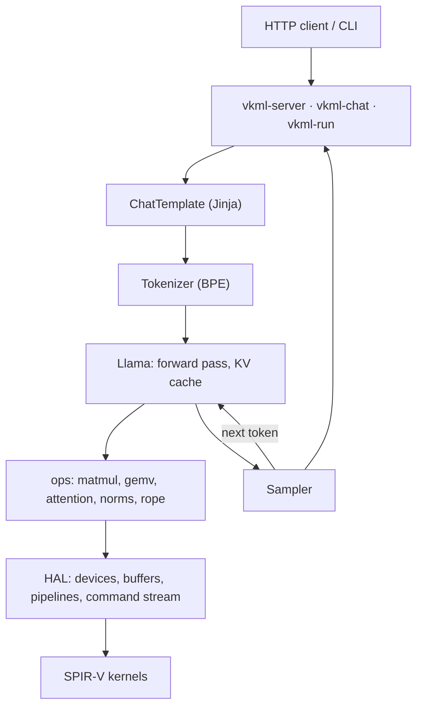

# Design

## Layout

```
include/vkml/   public API: Context, Tensor, ops, Llama, Tokenizer, ChatTemplate, Sampler
src/hal/        Vulkan: device selection, buffers (VMA), compute pipelines, command stream
src/core/       runtime (kernel cache, deferred frees), tensors
src/ops/        operator host code, one file per family
src/io/         safetensors, GGUF, tokenizers, Unicode tables, Jinja, sampling
src/models/     the model: config parsing, weight loading, forward pass
shaders/        GLSL compute kernels, compiled to SPIR-V and embedded at build time
apps/           vkml-chat, vkml-run, vkml-server, vkml-info, vkml-bench, vkml-tokenize
```



## Library

- **Tensors on the GPU**: f32, f16, bf16 and i32, with asynchronous execution
  and automatic lifetime management.
- **Operators**: elementwise arithmetic, SiLU/GeLU, softmax, argmax, RMSNorm,
  matmul (batched, transposed, 16-bit and quantized weights),
  permute/transpose, embedding lookup, rotary position embeddings (with LLaMA
  3.1 scaling), and scaled dot-product attention with causal masking,
  grouped-query attention and a KV cache.
- **Model**: `vkml::Llama` runs every supported architecture. Their
  differences are configuration: sliding windows, attention biases, per-head
  q and k norms, soft-capped scores, extra norms, fused projections (split as
  they load).
- **Tokenizers**: SentencePiece-style BPE (LLaMA 1/2, TinyLlama, Gemma) and
  byte-level BPE with the GPT-2, LLaMA 3, Qwen2 and o200k pre-tokenization
  rules, with NFC normalization. Merges run through a priority queue. Files
  using anything else are rejected with an error naming it.
- **Chat templates**: a small Jinja interpreter runs the template each model
  ships, exactly as `apply_chat_template` does.
- **Sampling**: temperature, top-k, top-p, min-p and repetition penalty, in
  `transformers`' order, seeded.

## Decisions

- **No Vulkan in public headers.** The API is plain C++. Vulkan stays behind
  `src/hal`, and its entry points load at run time through volk, so a machine
  without Vulkan fails with a clear error instead of at startup.
- **Asynchronous by default.** Operators record work into one command stream
  and return at once; only reading a tensor waits. A buffer freed while the
  GPU may still use it is retired against the stream's timeline semaphore and
  goes back to a pool when that work completes. A forward pass therefore
  reuses the same buffers every token instead of creating hundreds (which gets
  slower the more allocations a process holds).
- **The GPU starts before the host finishes.** The stream rotates through
  several command buffers, and the model submits each layer as soon as it is
  recorded, so recording the next layer overlaps running the last one. This
  alone took TinyLlama from 18.6 to 22 tokens/s.
- **Kernels are tuned to the device, not hard-coded.** Workgroup sizes and
  tiles come from the device's limits through specialization constants. The
  Vulkan spec only guarantees 128 invocations and 16 KiB of shared memory.
- **16-bit weights without 16-bit hardware features.** Kernels read f16/bf16
  weights as packed 32-bit words and widen them in registers, so memory use and
  bandwidth halve on any GPU while arithmetic stays f32. f16 is decoded by hand
  so subnormals survive.
- **Rotary tables are computed on the host in double precision.** Vulkan only
  bounds `sin`/`cos` error within [-π, π], and positions far into a context
  make angles of thousands of radians.
- **Decoding and prefill use different kernels.** A matrix-vector kernel reads
  the weights once, at close to memory bandwidth, for the few rows of
  decoding (up to 8). A register-blocked tiled kernel, its block shape chosen
  by row count, handles prompts.
- **Greedy decoding picks the token on the GPU.** `vkml::argmax` runs there and
  only 4 bytes come back, not every logit.

## Quantization

`--q8` stores each block of 32 weights as 32 bytes plus a scale; `--q4` as 16
bytes plus a scale. Scales are f16. On GPUs with accelerated int8 dot products
(`vkml-info` says), each layer's input is quantized to int8 once, and the
matrix-vector and tiled kernels multiply int8 by int8, four at a time. See
[performance.md](performance.md) for what that gained and
[correctness.md](correctness.md) for what it costs.

GGUF K-quants are mapped onto these formats as they load (see
[usage.md](usage.md#weight-formats)), with decoding and repacking spread over
every core.

## Attention and the KV cache

- **Decoding**: attention for one new token is one kernel split over chunks of
  128 keys, so a long cache gives the GPU many workgroups, then a small kernel
  merges the chunks. Heads up to 256 wide use it.
- **Prefill**: queries go in chunks whose scores stay under 64 MB, each
  against only the keys it can see, which also skips most of the masked half.
- **Sliding windows**: layers with a sliding window keep only the window's last
  rows plus 1,024 more, as a ring buffer. Gemma 3 1B's KV cache at a context of
  8,192 takes 136 MB instead of 436.
- **f16 cache**: `--kv-f16` halves the cache's memory. The default stays f32,
  which keeps logits within parts per million of `transformers`.
- **Server reuse**: the cache is kept between requests, so a conversation's
  next turn processes only its new messages.

## Large weights on small GPUs

A weight matrix too large for one GPU buffer (often 1 GB on integrated GPUs,
4 GB on discrete ones), such as Gemma 2 2B's 256,000 x 2,304 bf16 embeddings,
is quantized to Q8_0 as it loads, whatever the options ask. Quantized
embedding tables stay quantized, and tied output projections share them.
